# hvtop

hvtop is a TUI prototype for monitoring Windows and Hyper-V hosts, VMs when
Hyper-V is present, failover clusters, CSV/storage, physical disks, network, and
recent events.
It is shaped like `htop` or `esxtop`, but with fast drill-down views and a small
rolling history buffer for max/spike visibility.

The native implementation is written in C# with native Windows counters and no
PowerShell in the hot path.

## Screenshots

Click any thumbnail to open the full-size image.

| Cluster | Cluster Detail |
| --- | --- |
| <a href="docs/screenshots/hvtop-cluster.PNG">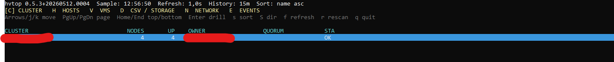</a> | <a href="docs/screenshots/hvtop-cluster-details.PNG">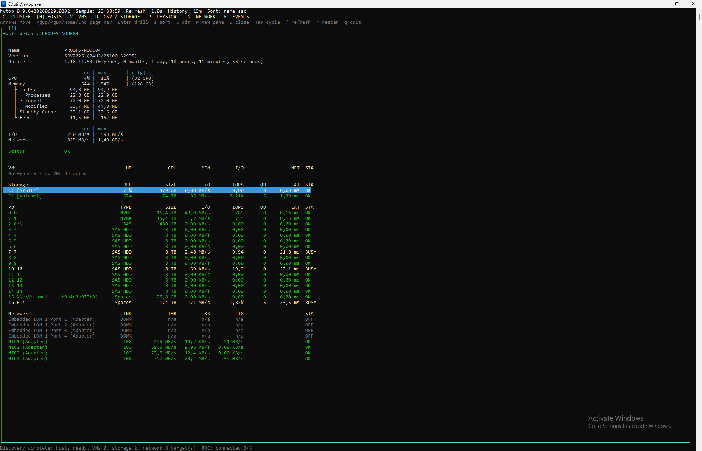</a> |

| Hosts | Host Detail | VMs |
| --- | --- | --- |
| <a href="docs/screenshots/hvtop-hosts.PNG">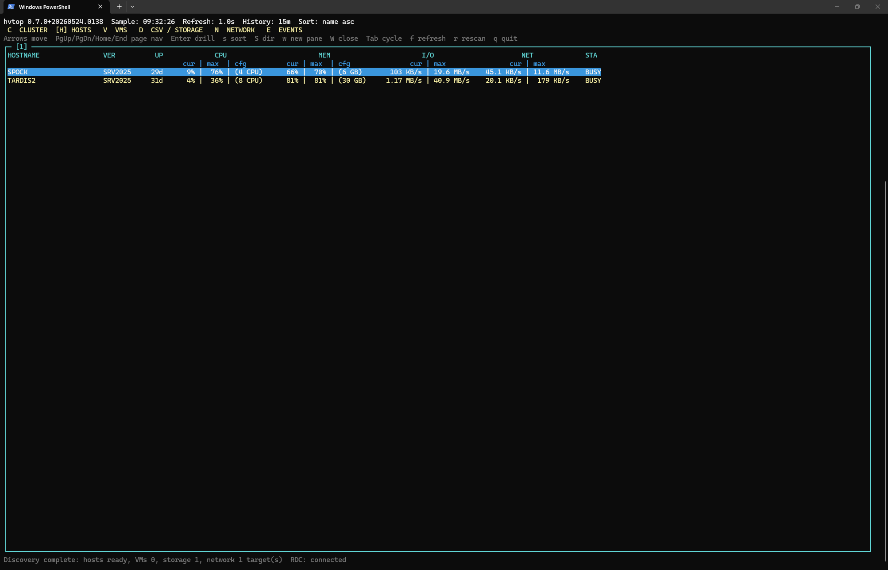</a> | <a href="docs/screenshots/hvtop-hosts-details.PNG">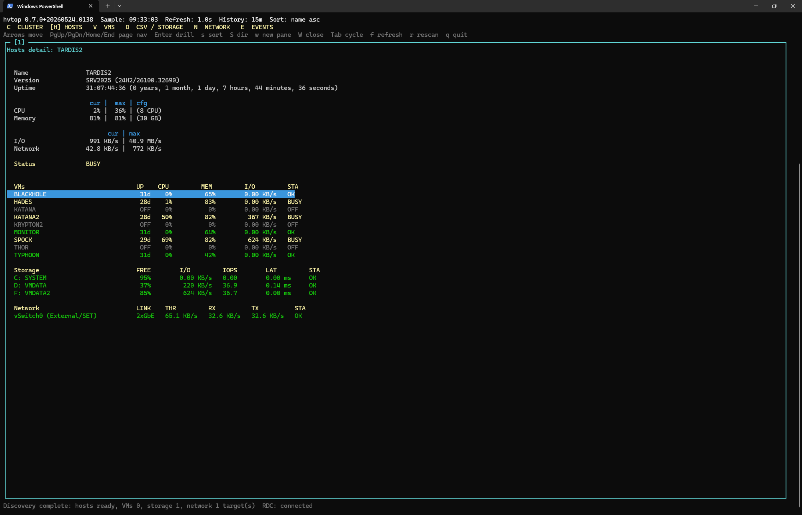</a> | <a href="docs/screenshots/hvtop-vms.PNG">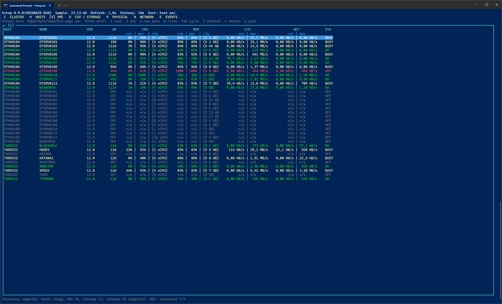</a> |

| VM Detail | Storage | Storage Detail |
| --- | --- | --- |
| <a href="docs/screenshots/hvtop-vms-details.PNG">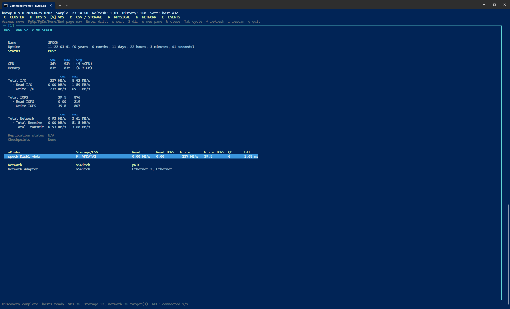</a> | <a href="docs/screenshots/hvtop-storage.PNG">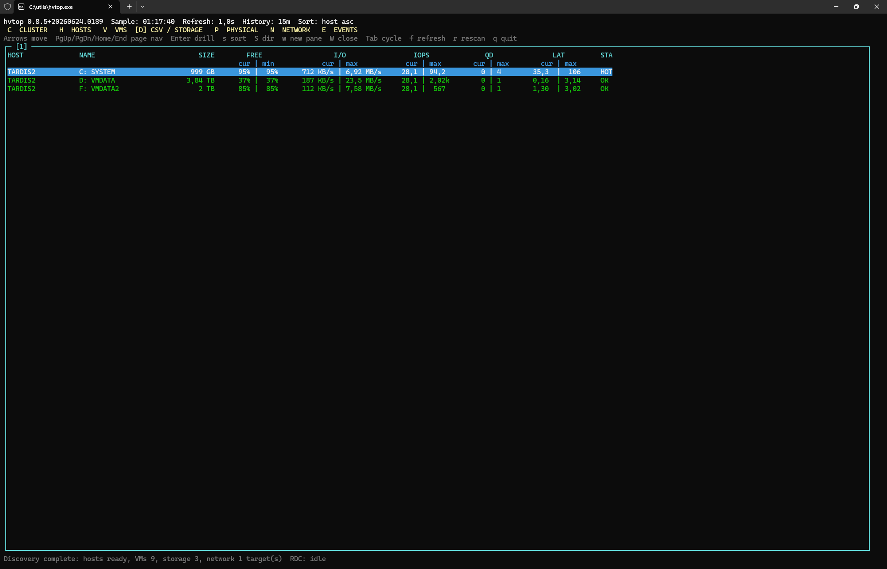</a> | <a href="docs/screenshots/hvtop-storage-details.PNG">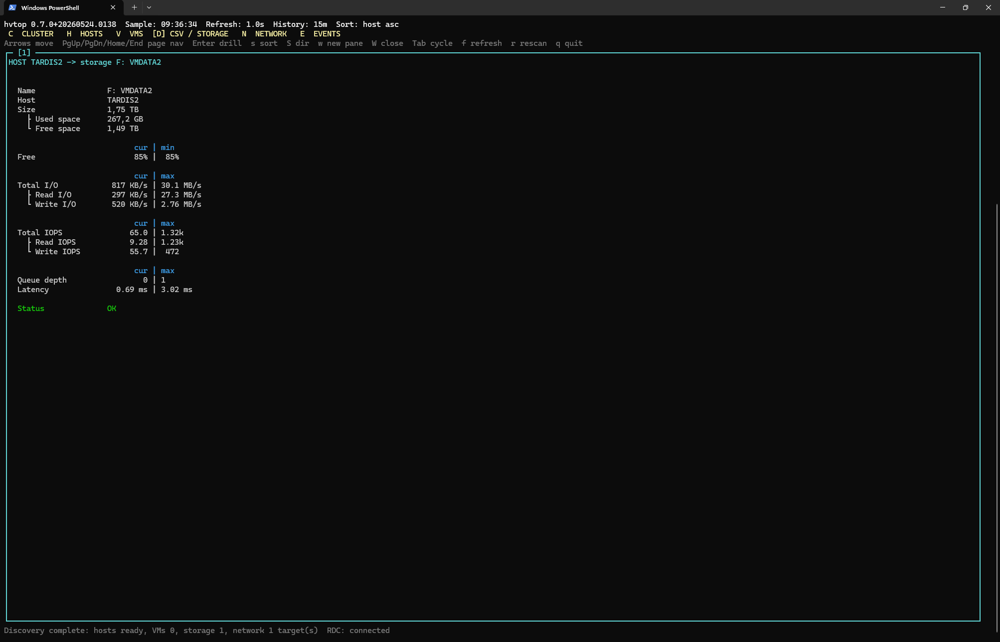</a> |

| vHDX Detail | Network | Physical NICs |
| --- | --- | --- |
| <a href="docs/screenshots/hvtop-vhdx-details.PNG">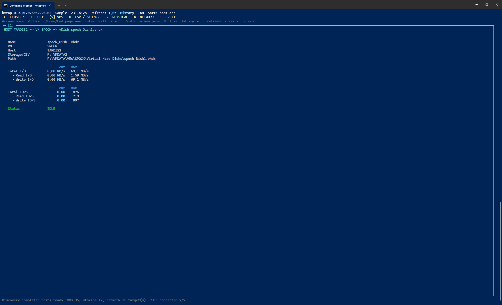</a> | <a href="docs/screenshots/hvtop-network.PNG">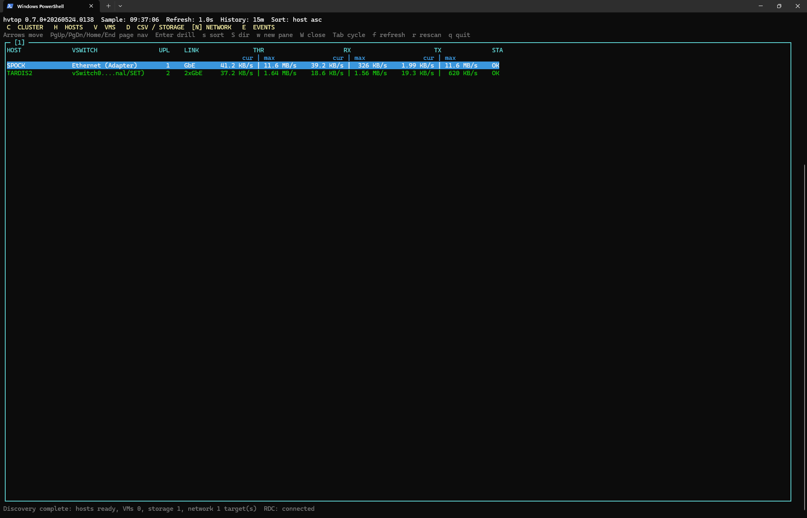</a> | <a href="docs/screenshots/hvtop-network-pnics.PNG">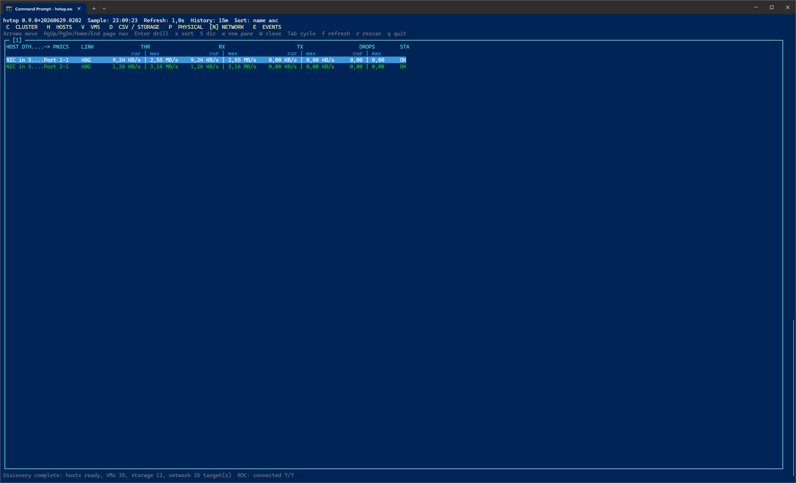</a> |

| Network pNIC Detail | pNIC Detail | vNIC Detail |
| --- | --- | --- |
| <a href="docs/screenshots/hvtop-network-pnics-details.PNG">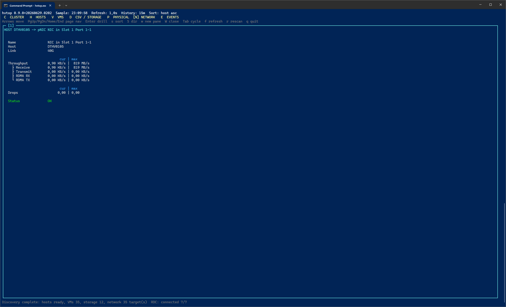</a> | <a href="docs/screenshots/hvtop-pnic-details.PNG">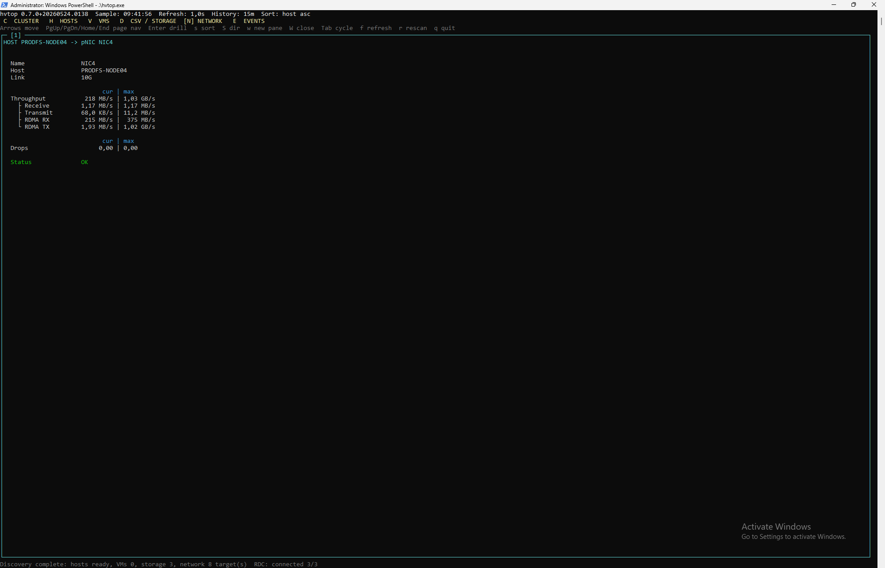</a> | <a href="docs/screenshots/hvtop-vnic-details.PNG">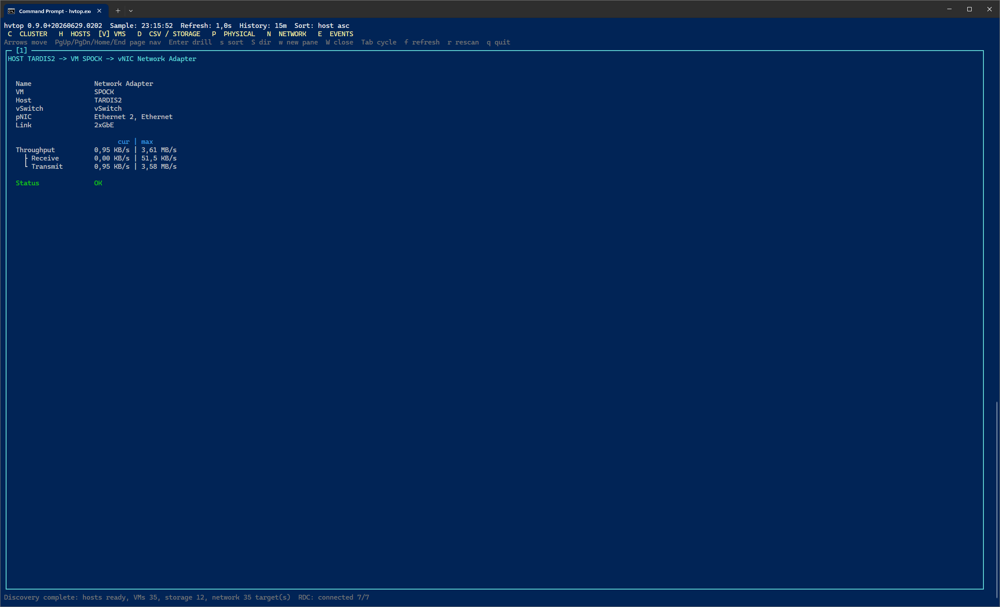</a> |

| Events |
| --- |
| <a href="docs/screenshots/hvtop-events.PNG">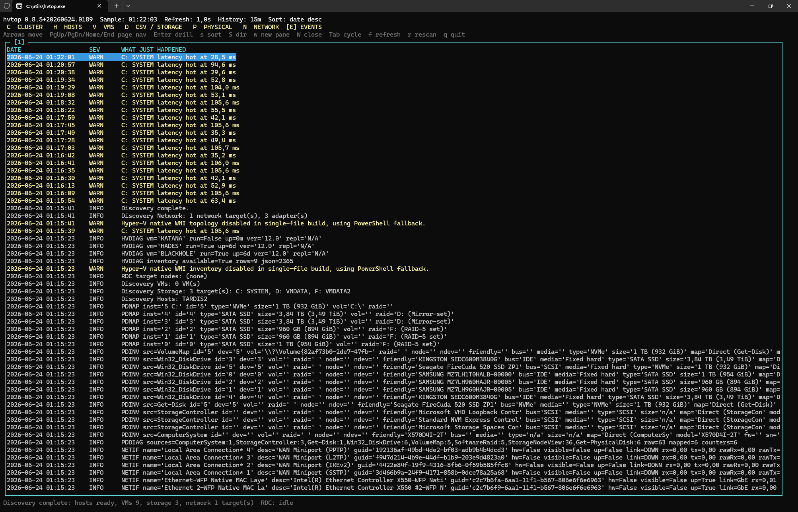</a> |

## Installing

Using winget: 

```powershell
winget install mazvazzeg.hvtop -e
```

or: [Download](https://github.com/mazvazzeg/hvtop/releases)

## Run Native (Building from source)

```powershell
cd .\hvtop.Native
dotnet run
```

Publish a single executable:

```powershell
dotnet publish -c Release -r win-x64 --self-contained true /p:PublishSingleFile=true /p:EnableCompressionInSingleFile=true
```

Build release zip packages:

```powershell
.\scripts\build-release.ps1
```

This creates both release variants under `artifacts\release`:

```text
hvtop-<version>-win-x64.zip
  hvtop.exe
  hvtop-rdc.exe

hvtop-<version>-win-x64-portable.zip
  hvtop.exe
  hvtop-rdc.exe
```

The non-portable `win-x64` package is framework-dependent and requires the .NET
8 runtime on the target host. The `win-x64-portable` package is self-contained.

Useful options:

```powershell
dotnet run -- --refresh 1 --history 15
dotnet run -- --rdc-host HV01 --rdc-user DOMAIN\AdminUser --rdc-password "secret"
dotnet run -- --rdc-host HV01 --rdc-token "shared-secret"
dotnet run -- --rdc-disable
dotnet run -- --debug-log
dotnet run -- --smoke
```

## Command Line Options

`hvtop.exe` accepts these options:

```text
--refresh <seconds>        Local UI/data refresh interval. Default: 1, minimum: 1
--history <minutes>        History window for max/min values. Default: 15
--rdc-port <n>             Remote Data Collector TCP port. Default: 54321
--rdc-refresh <seconds>    Remote Data Collector interval. Default: 1
--rdc-host <host>          Deploy/poll hvtop-rdc on an explicit remote host.
--rdc-user <user>          Username for remote ADMIN$/CIM access.
--rdc-password <password>  Password for remote ADMIN$/CIM access.
--rdc-token <value>        Token passed to hvtop-rdc. Default: generated per run.
--rdc-disable              Disable remote data collection.
--local-disable            Disable local data collection; requires --rdc-host.
--debug-log                Write hvtop.log; also enables remote hvtop-rdc.log.
--smoke                    Print one sample and exit.
--help                     Show help.
--version                  Show version and exit.
```

`hvtop-rdc.exe` is normally deployed and started by `hvtop.exe`, but accepts:

```text
--port <n>                 Listen TCP port. Default: 54321
--listen <prefix>          HTTP listener prefix. Default: http://+:<port>/
--refresh <seconds>        Collection interval. Default: 1
--history <minutes>        History window. Default: 15
--token <value>            Required token for incoming requests.
--debug-log                Write hvtop-rdc.log beside the executable.
--help                     Show help.
--version                  Show version and exit.
```

The native version currently uses PDH for host CPU, memory, disk throughput,
IOPS, queue depth, and latency. Network rates come from the native Windows IP
Helper API. VM rows are populated from Hyper-V inventory and counters when
Hyper-V is available; otherwise the VM pane is empty and the host/storage/network
panes remain useful on standard Windows servers.

## Keys

- `C`: Cluster
- `H`: Hosts
- `V`: VMs
- `D`: CSV/storage
- `P`: Physical disks
- `N`: Network
- `E`: Events
- `Up/Down`: move selection
- `PgUp/PgDn/Home/End`: page navigation
- `Enter`: drill down
- `s`: select sort column
- `S`: toggle sort direction
- `w`: open a new pane
- `W`: close the active pane
- `Tab`: cycle panes
- `f`: cycle refresh delay
- `r`: rescan inventory/topology
- `Backspace` or `Esc`: back
- `q`: quit

## Drill Down

The intended navigation path is:

```text
CLUSTER -> HOSTS -> select host -> host detail -> select VM -> VM detail
```

On non-cluster hosts, the flow starts at `HOSTS`. On standard Windows servers
without Hyper-V, the VM pane is expected to be empty.

The top-level `VMs`, `CSV/storage`, `Physical disks`, and `Network` panes are
global views. In cluster/RDC mode they include rows from all reporting hosts and
show a `HOST` column so the source node is visible.

Detail panes resolve the selected row from the latest snapshot on every repaint,
so values continue updating live while you are drilled in.

## First Panels

- Clusters: cluster name, number of nodes, nodes in UP status, owner node
- Hosts: hostname, version, uptime, CPU, memory, I/O, network, status
- VMs: host, name, version, uptime, CPU, memory, I/O, network, status
- CSV/storage: host, name, free space, I/O, IOPS, queue depth, latency, status
- Physical disks: host, PDID, type, size, I/O, IOPS, queue depth, latency, status
- Network: host, vSwitch or adapter, link, throughput, receive, transmit, drops, status
- Events: timestamped status, spike, and collector events

Each metric shows current and max-in-history values as `current | max`. The history
window defaults to 15 minutes.

Metric values use a compact four-character numeric display where the unit is
outside the number. Examples: `999 KB/s`, `1.00 MB/s`, `1.32 GB/s`, `32.2 GB/s`.
Throughput values scale on binary boundaries: `1024 KB/s` becomes `1.00 MB/s`,
`1024 MB/s` becomes `1.00 GB/s`, and the same 1024-based rule is used for
capacity values such as `MB`, `GB`, and `TB`.

## Remote Data Collector

On Failover Cluster setups, hvtop can start an RDC (Remote Data Collector)
process on peer nodes if the `ADMIN$` share is accessible for the currently
logged-in user. `hvtop-rdc.exe` reports the same metrics to the local `hvtop.exe`
process through a small HTTP interface. The main `hvtop.exe` process polls those
remote collectors and merges the returned host/VM/storage/network telemetry into
the local view.

Outside a cluster, an admin workstation can target one remote host explicitly:

```powershell
hvtop.exe --rdc-host HV01 --rdc-user DOMAIN\AdminUser --rdc-password "secret"
```

When `--rdc-host` is used, hvtop deploys `hvtop-rdc.exe` to that host through
`ADMIN$`, starts it through CIM or a legacy WMI/DCOM fallback, and merges the
remote telemetry with the local host view once data arrives. If `--rdc-user` and
`--rdc-password` are omitted, hvtop uses the current Windows logon context.

By default hvtop generates a per-run RDC token and passes it to `hvtop-rdc.exe`.
Use `--rdc-token` to set a known token manually, for example when checking the
remote collector endpoint with curl:

```powershell
hvtop.exe --rdc-host HV01 --rdc-token "shared-secret"
curl "http://HV01:54321/snapshot?token=shared-secret"
```

Local collection remains enabled by default even when `--rdc-host` is specified,
so the local host still has useful data if the remote target is unavailable. Use
`--local-disable` for remote-only workstation mode. In that mode `--rdc-host` is
required. If the remote collector cannot be deployed or polled, hvtop keeps the
TUI open, shows the terminal RDC error in the bottom status line, and leaves the
Events pane available for the detailed failure trail.

## Physical Disk Discovery

The `P` physical disk pane uses native `PhysicalDisk(*)` PDH counters for the
hot-path metrics: I/O, IOPS, queue depth, and latency. Inventory data is resolved
less frequently and is used only to label those counter instances with useful
metadata such as PDID, type, size, friendly name, model, firmware, and serial.

hvtop correlates physical disk counter instances with several Windows inventory
sources:

- `Get-Disk` for Windows disk number, bus type, media type, size, and friendly
  name.
- `Win32_DiskDrive` for model, manufacturer, firmware revision, serial number,
  and virtual/emulated disk hints.
- `Get-PhysicalDisk -PhysicallyConnected` and `Get-PhysicalDisk` for Storage
  Spaces and S2D physical disk identity.
- `Get-PhysicalDiskStorageNodeView` when available, so cluster/S2D nodes can map
  the disks that are physically connected to the current node.
- `Win32_ComputerSystem` and `Win32_SCSIController` as a fallback for virtual
  machines, so otherwise anonymous rows can still show labels such as
  `Hyper-V Storage`, `VMware PVSCSI`, `VirtIO Storage`, or `VirtualBox Storage`
  instead of plain `n/a`.

Physical disk sizes are displayed as vendor/marketing capacity with the binary
capacity in details, for example `8 TB (7.28 TiB)`. The overview pane keeps the
short vendor-style value to save horizontal space.

## Native Collection Direction

The native collector should use:

- PDH/perflib counters for high-frequency metrics.
- Hyper-V WMI/CIM APIs for topology and inventory, sampled less frequently.
- Cluster APIs for CSV ownership and CSV-specific state.
- ETW later for event-rich timelines where counters are not enough.

Good next additions are:

- Per-VM Hyper-V counter mapping for network and virtual disk throughput.
- Cluster Shared Volume discovery without shelling out to PowerShell.
- Per-vDisk Level 3 drill-down from VM hard disk inventory and virtual storage
  counters
- Threshold configuration in a JSON file.
- CSV or JSON event export.
