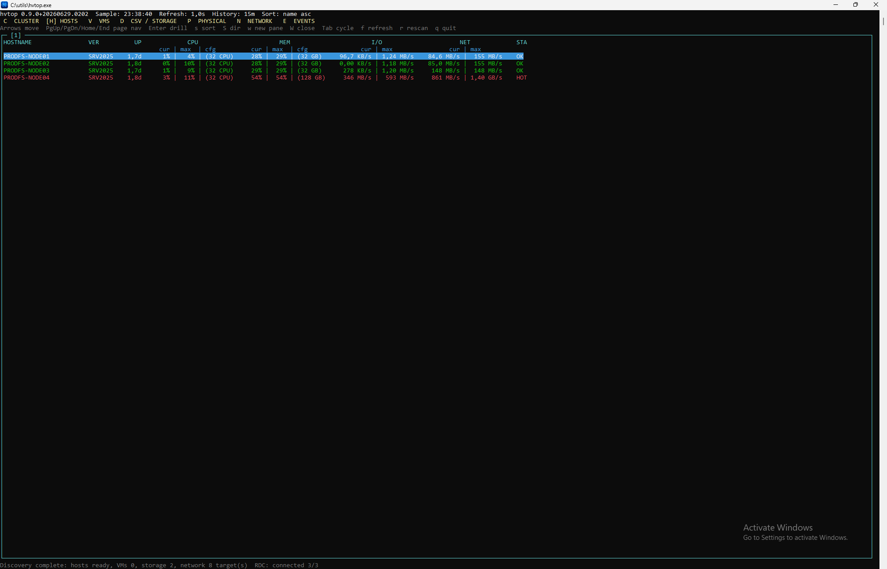
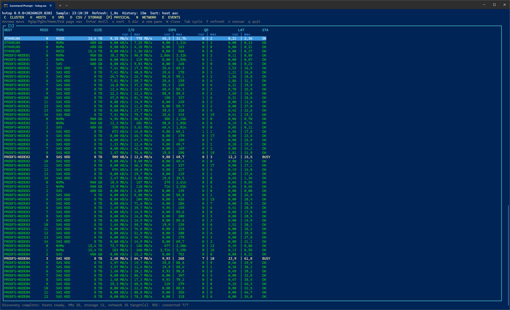
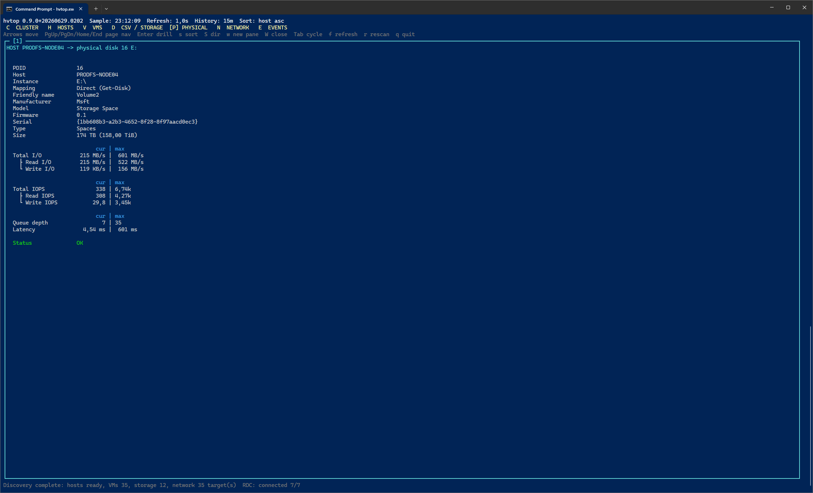

# hvtop

hvtop is a TUI prototype for monitoring Windows and Hyper-V hosts, VMs when
Hyper-V is present, failover clusters, CSV/storage, physical disks, network, and
recent events.
It is shaped like `htop` or `esxtop`, but with fast drill-down views and a small
rolling history buffer for max/spike visibility.

The implementation is written in C# and keeps the high-frequency metric path on
native Windows APIs/counters. PowerShell is still used for slower inventory,
topology, deployment, and compatibility probes where Windows exposes the useful
shape most reliably through cmdlets or CIM/WMI wrappers.

## Screenshots

Click any thumbnail to open the full-size image.

| Cluster | Cluster Hosts | Cluster Detail |
| --- | --- | --- |
| <a href="docs/screenshots/hvtop-cluster.PNG"></a> | <a href="docs/screenshots/hvtop-cluster-hosts.PNG"></a> | <a href="docs/screenshots/hvtop-cluster-details.PNG"></a> |

| Hosts | Host Detail | VMs |
| --- | --- | --- |
| <a href="docs/screenshots/hvtop-hosts.PNG"></a> | <a href="docs/screenshots/hvtop-hosts-details.PNG"></a> | <a href="docs/screenshots/hvtop-vms.PNG"></a> |

| VM Detail | Storage | Storage Detail |
| --- | --- | --- |
| <a href="docs/screenshots/hvtop-vms-details.PNG"></a> | <a href="docs/screenshots/hvtop-storage.PNG"></a> | <a href="docs/screenshots/hvtop-storage-details.PNG"></a> |

| Physical Disks | Physical Disk Detail |
| --- | --- |
| <a href="docs/screenshots/hvtop-physical.PNG"></a> | <a href="docs/screenshots/hvtop-physical-details.PNG"></a> |

| vHDX Detail | Network | Physical NICs |
| --- | --- | --- |
| <a href="docs/screenshots/hvtop-vhdx-details.PNG"></a> | <a href="docs/screenshots/hvtop-network.PNG"></a> | <a href="docs/screenshots/hvtop-network-pnics.PNG"></a> |

| Network pNIC Detail | vNIC Detail |
| --- | --- |
| <a href="docs/screenshots/hvtop-network-pnics-details.PNG"></a> | <a href="docs/screenshots/hvtop-vnic-details.PNG"></a> |

| Events |
| --- |
| <a href="docs/screenshots/hvtop-events.PNG"></a> |

## Installing

Using winget: 

```powershell
winget install mazvazzeg.hvtop -e
```

or: [Download](https://github.com/mazvazzeg/hvtop/releases)

## Run Native (Building from source)

```powershell
cd .\hvtop.Native
dotnet run
```

Publish a single executable:

```powershell
dotnet publish -c Release -r win-x64 --self-contained true /p:PublishSingleFile=true /p:EnableCompressionInSingleFile=true
```

Build release zip packages:

```powershell
.\scripts\build-release.ps1
```

This creates both release variants under `artifacts\release`:

```text
hvtop-<version>-win-x64.zip
  hvtop.exe
  hvtop-rdc.exe
  hvtop-rdc.conf.SAMPLE
  SHA256SUMS.txt

hvtop-<version>-win-x64-portable.zip
  hvtop.exe
  hvtop-rdc.exe
  hvtop-rdc.conf.SAMPLE
  SHA256SUMS.txt
```

The non-portable `win-x64` package is framework-dependent and requires the .NET
8 runtime on the target host. The `win-x64-portable` package is self-contained.

Useful options:

```powershell
dotnet run -- --refresh 1 --history 15
dotnet run -- --rdc-host HV01 --rdc-user DOMAIN\AdminUser --rdc-password "secret"
dotnet run -- --rdc-config .\hvtop-rdc.conf --rdc-timeout 5 --rdc-copy-timeout 60
dotnet run -- --rdc-host HV01 --rdc-token "shared-secret"
dotnet run -- --rdc-disable
dotnet run -- --ldc-disable --rdc-host HV01
dotnet run -- --debug-log
dotnet run -- --smoke
```

## Command Line Options

`hvtop.exe` accepts these options:

```text
--refresh <seconds>        Local UI/data refresh interval. Default: 1, minimum: 1
--history <minutes>        History window for max/min values. Default: 15
--rdc-port <n>             Remote Data Collector TCP port. Default: 54321
--rdc-refresh <seconds>    Remote Data Collector interval. Default: 1
--rdc-timeout <seconds>    RDC connect/deploy/poll timeout. Default: 5
--rdc-copy-timeout <sec>   RDC ADMIN$ copy timeout. Default: 60
--rdc-host <host>          Deploy/poll hvtop-rdc on an explicit remote host.
--rdc-config <path>        RDC target config file. Default: hvtop-rdc.conf beside hvtop.exe.
--rdc-user <user>          Username for remote ADMIN$/CIM access.
--rdc-password <password>  Password for remote ADMIN$/CIM access.
--rdc-token <value>        Token passed to hvtop-rdc. Default: generated per run.
--rdc-skip-deploy          Poll existing hvtop-rdc agents; requires --rdc-token or config token.
--rdc-disable              Disable remote data collection.
--ldc-disable              Disable local data collection; requires --rdc-host or RDC config.
--local-disable            Deprecated alias for --ldc-disable; removed at 1.0.
--debug-log                Write hvtop.log; also enables remote hvtop-rdc.log.
--smoke                    Print one sample and exit.
--help                     Show help.
--version                  Show version and exit.
```

`hvtop-rdc.exe` is normally deployed and started by `hvtop.exe`, but accepts:

```text
--port <n>                 Listen TCP port. Default: 54321
--listen <prefix>          HTTP listener prefix. Default: http://+:<port>/
--refresh <seconds>        Collection interval. Default: 1
--history <minutes>        History window. Default: 15
--token <value>            Required token for incoming requests.
--debug-log                Write hvtop-rdc.log beside the executable.
--help                     Show help.
--version                  Show version and exit.
```

The native version currently uses PDH for host CPU, memory, disk throughput,
IOPS, queue depth, latency, VM counters, virtual disk counters, network adapter
counters, Hyper-V switch counters, and RDMA counters. Network adapter base rates
also use the native Windows IP Helper API. VM rows are populated from Hyper-V
inventory and counters when Hyper-V is available; otherwise the VM pane is empty
and the host/storage/network/physical-disk panes remain useful on standard
Windows servers.

## Keys

- `C`: Cluster
- `H`: Hosts
- `V`: VMs
- `D`: CSV/storage
- `P`: Physical disks
- `N`: Network
- `E`: Events
- `Up/Down`: move selection
- `PgUp/PgDn/Home/End`: page navigation
- `Enter`: drill down
- `s`: select sort column
- `S`: toggle sort direction
- `w`: open a new pane
- `W`: close the active pane
- `Tab`: cycle panes
- `f`: cycle refresh delay
- `r`: rescan inventory/topology
- `Backspace` or `Esc`: back
- `q`: quit

## Drill Down

The intended navigation path is:

```text
CLUSTER -> HOSTS -> select host -> host detail -> select VM -> VM detail
```

On non-cluster hosts, the flow starts at `HOSTS`. On standard Windows servers
without Hyper-V, the VM pane is expected to be empty.

The top-level `VMs`, `CSV/storage`, `Physical disks`, and `Network` panes are
global views. In cluster/RDC mode they include rows from all reporting hosts and
show a `HOST` column so the source node is visible.

Detail panes resolve the selected row from the latest snapshot on every repaint,
so values continue updating live while you are drilled in.

## Data Sources

hvtop separates live counters from slower discovery work:

- Hot-path metrics use native APIs and PDH/perflib counters. This includes host
  CPU and memory, logical and physical disk throughput/IOPS/queue depth/latency,
  VM CPU/memory/I/O/network counters, Hyper-V virtual switch counters, physical
  NIC counters, and RDMA activity counters.
- Network adapter identity, link state, link speed, and raw byte counters use
  the Windows IP Helper API.
- Hyper-V VM inventory, VM configuration, dynamic memory settings, replication
  status, vDisk/vNIC topology, vSwitch topology, SET/LBFO hints, and checkpoint
  state currently use PowerShell-hosted Hyper-V cmdlets and CIM/WMI queries.
- Failover Cluster discovery currently uses PowerShell-hosted cluster cmdlets.
- Physical disk inventory uses a PowerShell-hosted mix of `Get-Disk`,
  `Get-PhysicalDisk`, `Get-PhysicalDiskStorageNodeView`,
  `Get-StorageBusClientDevice`, and CIM classes such as `Win32_DiskDrive`,
  `Win32_ComputerSystem`, and `Win32_SCSIController`.
- Windows software RAID membership detection uses `diskpart` (`list volume` and
  `detail volume`) during inventory refresh, then joins the detected set
  membership to physical disk rows.
- Remote Data Collector deployment uses `ADMIN$` file copy, CIM/WinRM process
  start/stop, and a legacy WMI/DCOM fallback when CIM/WinRM is unavailable.

hvtop does not currently call `wmic.exe`; when Win32 information is needed it is
queried through CIM/WMI from PowerShell or .NET-side APIs. The goal is still to
move more topology/inventory collection to native APIs over time, but the
performance-sensitive metric loop should remain free of PowerShell polling.

## First Panels

- Clusters: cluster name, number of nodes, nodes in UP status, owner node
- Hosts: hostname, version, uptime, CPU, memory, I/O, network, status
- VMs: host, name, version, uptime, CPU, memory, I/O, network, status
- CSV/storage: host, name, free space, I/O, IOPS, queue depth, latency, status
- Physical disks: host, PDID, type, size, I/O, IOPS, queue depth, latency, status
- Network: host, vSwitch or adapter, link, throughput, receive, transmit, drops, status
- Events: timestamped status, spike, and collector events

Each metric shows current and max-in-history values as `current | max`. The history
window defaults to 15 minutes.

Metric values use a compact four-character numeric display where the unit is
outside the number. Examples: `999 KB/s`, `1.00 MB/s`, `1.32 GB/s`, `32.2 GB/s`.
Throughput values scale on binary boundaries: `1024 KB/s` becomes `1.00 MB/s`,
`1024 MB/s` becomes `1.00 GB/s`, and the same 1024-based rule is used for
capacity values such as `MB`, `GB`, and `TB`.

## Remote Data Collector

On Failover Cluster setups, hvtop can start an RDC (Remote Data Collector)
process on peer nodes if the `ADMIN$` share is accessible for the currently
logged-in user. `hvtop-rdc.exe` reports the same metrics to the local `hvtop.exe`
process through a small HTTP interface. The main `hvtop.exe` process polls those
remote collectors and merges the returned host/VM/storage/network telemetry into
the local view.

Outside a cluster, an admin workstation can target one remote host explicitly:

```powershell
hvtop.exe --rdc-host HV01 --rdc-user DOMAIN\AdminUser --rdc-password "secret"
```

When `--rdc-host` is used, hvtop deploys `hvtop-rdc.exe` to that host through
`ADMIN$`, starts it through CIM or a legacy WMI/DCOM fallback, and merges the
remote telemetry with the local host view once data arrives. If `--rdc-user` and
`--rdc-password` are omitted, hvtop uses the current Windows logon context.
If `--rdc-user` is specified, `--rdc-password` is required.

Multiple remote targets can be listed in an RDC config file. By default hvtop
looks for `hvtop-rdc.conf` beside `hvtop.exe`; use `--rdc-config <path>` to
point at another file. If no RDC config file is found and no explicit
`--rdc-host` is specified, hvtop starts as before.

```text
# hvtop-rdc.conf
# RDC defaults; per-host fields can override these
PORT:54321
REFRESH:5
TIMEOUT:10
COPY-TIMEOUT:60
TOKEN:shared-secret
SKIP-DEPLOY

# host-only rows use the current Windows logon context
HV01
HV02:DOMAIN\AdminUser:secret
HV03:admin@domain.tld:secret
HV04:DOMAIN\AdminUser:secret:54321:host-specific-token:false
HV05:::54322:manual-agent-token:SKIP-DEPLOY
```

The first non-comment line may change the delimiter. This is useful when
passwords contain `:`.

```text
DELIMITER:;
HV04;DOMAIN\AdminUser;p@ss:word
```

Blank lines and lines starting with `#`, `//`, or `;` are ignored. The first
non-comment line may be a `DELIMITER` declaration; otherwise `:` is used.
Settings use `:` or `=` regardless of the active row delimiter. Fields may be
quoted, and `\`, `"`, or the active delimiter can be escaped with a backslash.
A row is either `host`, `host<delimiter>username<delimiter>password`, or the
full form `host<delimiter>username<delimiter>password<delimiter>port<delimiter>token<delimiter>skip-deploy`.
Use empty username/password fields for current credentials with per-host port or
token values, for example `HV05:::54322:manual-agent-token:SKIP-DEPLOY` with
the default delimiter. A username without a password is rejected and logged. Config
files with credentials are clear text, so hvtop logs a warning when one is
loaded.

Passwords in `hvtop-rdc.conf` are read directly by hvtop, so shell-sensitive
characters such as `%`, `^`, `&`, and `-` do not need command-line escaping when
the file is edited normally. If a config file is generated from a batch script,
escape percent signs there (`%%`) before the file is written.

The RDC config file may also set `PORT`, `REFRESH`, `TIMEOUT`,
`COPY-TIMEOUT`, `TOKEN`, and `SKIP-DEPLOY`. Values are seconds except for
`PORT`; `SKIP-DEPLOY` accepts a bare `SKIP-DEPLOY` line, `true/false`,
`yes/no`, `on/off`, or `1/0`. Per-host `skip-deploy` fields also accept
`SKIP-DEPLOY` as the true value. These become RDC defaults for that run. Per-host
`port`, `token`, and `skip-deploy` fields override those defaults for that
target. Explicit command line options such as `--rdc-port`, `--rdc-refresh`,
`--rdc-timeout`, `--rdc-copy-timeout`, `--rdc-token`, and `--rdc-skip-deploy`
set the process defaults used by explicit RDC hosts, cluster targets, and config
rows that do not specify their own value.

`--rdc-timeout <seconds>` controls remote connect, process start/stop, and poll
timeouts. The default is 5 seconds. `--rdc-copy-timeout <seconds>` controls the
ADMIN$ copy timeout separately and defaults to 60 seconds, because copying the
agent over VPN links can legitimately take longer than a normal liveness probe.
Unreachable hosts and invalid credentials are logged and skipped instead of
being retried every refresh forever.

By default hvtop generates a per-run RDC token and passes it to `hvtop-rdc.exe`.
Use `--rdc-token` to set a known token manually, for example when checking the
remote collector endpoint with curl:

```powershell
hvtop.exe --rdc-host HV01 --rdc-token "shared-secret"
curl "http://HV01:54321/snapshot?token=shared-secret"
```

When `--rdc-skip-deploy` or `SKIP-DEPLOY:true` is used, hvtop does not copy,
start, stop, or delete `hvtop-rdc.exe`; it only polls an already running remote
collector. In that mode a known token is required through `--rdc-token`,
`TOKEN` in the config file, or a per-host token field.

LDC (Local Data Collection) remains enabled by default even when `--rdc-host` is
specified, so the local host still has useful data if the remote target is
unavailable. Use `--ldc-disable` for remote-only workstation mode. In that mode
`--rdc-host` or an RDC config target is required. The older `--local-disable`
spelling is accepted as a deprecated alias until hvtop 1.0. If the remote
collector cannot be deployed or polled, hvtop keeps the TUI open, shows the
terminal RDC error in the bottom status line, and leaves the Events pane
available for the detailed failure trail.

## Physical Disk Discovery

The `P` physical disk pane uses native `PhysicalDisk(*)` PDH counters for the
hot-path metrics: I/O, IOPS, queue depth, and latency. Inventory data is resolved
less frequently and is used only to label those counter instances with useful
metadata such as PDID, type, size, friendly name, model, firmware, and serial.

hvtop correlates physical disk counter instances with several Windows inventory
sources:

- `Get-Disk` for Windows disk number, bus type, media type, size, and friendly
  name.
- `Win32_DiskDrive` for model, manufacturer, firmware revision, serial number,
  and virtual/emulated disk hints.
- `Get-PhysicalDisk -PhysicallyConnected` and `Get-PhysicalDisk` for Storage
  Spaces and S2D physical disk identity.
- `Get-PhysicalDiskStorageNodeView` when available, so cluster/S2D nodes can map
  the disks that are physically connected to the current node.
- `Win32_ComputerSystem` and `Win32_SCSIController` as a fallback for virtual
  machines, so otherwise anonymous rows can still show labels such as
  `Hyper-V Storage`, `VMware PVSCSI`, `VirtIO Storage`, or `VirtualBox Storage`
  instead of plain `n/a`.
- `diskpart` for Windows dynamic/software RAID volume membership, so host
  details can show labels such as `3 D: (Mirror-set)` or
  `1 E: (RAID-5 set)` in the physical disk instance column.

Physical disk sizes are displayed as vendor/marketing capacity with the binary
capacity in details, for example `8 TB (7.28 TiB)`. The overview pane keeps the
short vendor-style value to save horizontal space.

## Native Collection Direction

The collector direction is:

- PDH/perflib counters for high-frequency metrics.
- Native APIs first for topology and inventory where the native surface is
  practical and reliable.
- Hyper-V WMI/CIM APIs or PowerShell cmdlets for topology/inventory gaps, sampled
  less frequently than live counters.
- Cluster APIs or cluster cmdlets for CSV ownership and CSV-specific state.
- ETW later for event-rich timelines where counters are not enough.

Good next additions are:

- Per-VM Hyper-V counter mapping for network and virtual disk throughput.
- Cluster Shared Volume discovery without shelling out to PowerShell.
- Per-vDisk Level 3 drill-down from VM hard disk inventory and virtual storage
  counters
- Threshold configuration in a JSON file.
- CSV or JSON event export.
